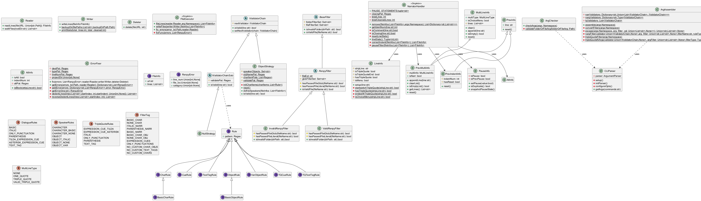

<div align="center">
  <h1>No Narrate</h1>
  <p>A tool for removing narration and thoughts from Ren'Py visual novel games.</p>
</div>

## Idea

A story should unfold *organically*. Let the **environment**, characters' **actions**,
and active **scenarios** carry the narrative. Players are 
*encouraged* to draw their own interpretations 
of the events unfolding.

## Types of Narration

There are 2 sectors to identify narration in Ren'Py:

- *Character/Speaker*
- *Dialogue*

  ### Ren'Py Narrator Example

  

## Requirements

- Python 3.12+
- Ren'Py game with *.rpy* files

## Installation

There are multiple ways to install/upgrade.

### From GitHub

```bash
python -m pip install "nonarrate @ git+https://github.com/ZimCodes/nonarrate.git"
```

### From Source Code

```bash
git clone https://github.com/ZimCodes/nonarrate.git && cd nonarrate
python -m pip install .
```

**To Uninstall**:

```bash
python -m pip uninstall nonarrate
```

## Usage

For instructions on how to use nonarrate, see [INSTRUCTIONS.md](INSTRUCTIONS.md)!

See [COMMANDS.md](./COMMANDS.md) for a full list of commands!

## Project Structure



## License

**nonarrate** is subject under the [Unlicense](./UNLICENSE) license.
