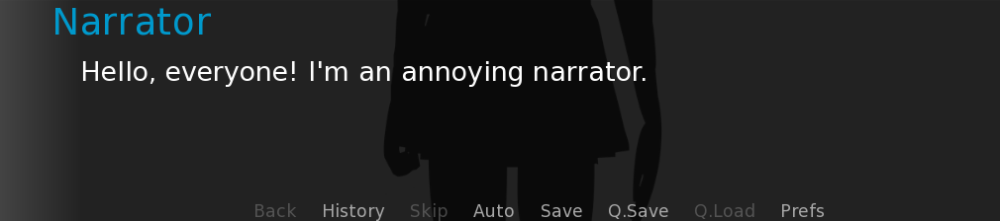

# No Narrate - Ren'Py Mod

Removes narration and thoughts from Ren'Py visual novel games.

This is a Ren'Py tool for removing the narrator from visual novel games. It will also remove what characters are
thinking about.

## Goal

A story should unfold organically. The characters' actions, environment, and scenarios should carry the
narrative, without the need of an inner voice or overt explanation. Players are encouraged to draw their own
interpretations of the events unfolding in the story thus far.

## Types of Narration

There are 2 places to identify narration in Ren'Py:

- _Character/Speaker_
- _Dialogue_

    
Ren'Py Narrator Example

    

### Character/Speaker

| Type  | Script Example                       | Description |
|:-----:|--------------------------------------|-------------|
| Basic | `"Narrator" "I'm an awesome person"` | Includes    |

### Dialogue

## Scripts

|        Name        | Description                                                       |
|:------------------:|-------------------------------------------------------------------|
|  no_char_narrator  | Removes narration and thoughts from Ren'Py's `Character()`        |
| no_basic_narration | Removes basic narration & thoughts from  `"This is a narration."` |
|    error_fixer     | Fix errors provided by _errors.txt_                               |                                               